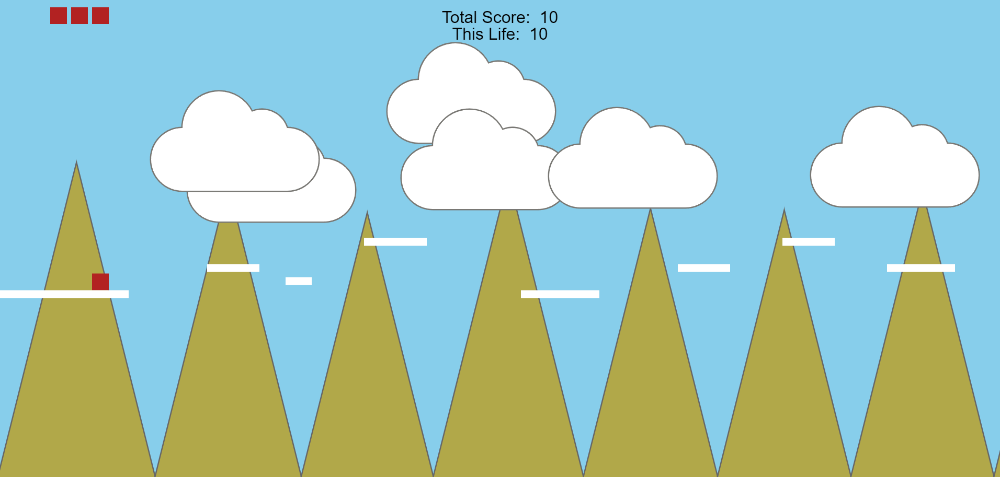

# Platformancer

### A JavaScript an HTML Canvas based platformer game

## Play it right now on GitHub Pages!

https://mike-gustafson.github.io/platformancer/

## Controls

User the left and right arrow keys on your weyboard to move left and right.  The spacebar will make you jump. 

## Introduction:
This project showcases the abilities of HTML5 canvas and JavaScript.  The JavaScaript renders all items on screen and the player jumps a box from platform to platform in classic fashion.  The goal is to get to an exit on the right side of the level.  The graphics and design were kept simple to allow more time and effort into the control setup and smoothness of gameplay.


## Technologies Used:

### HTML5
### JavaScript
### CSS

## Installation Instructions:
- open your terminal and navigate to the folder you want  the project located in.
- copy or type: 
        git clone https://github.com/mike-gustafson/game-project.git
- make sure VSCode is installed with the Live Server extention
- navigate to the game-project folder
- type:
        code .
- open index.html with Live Server

No local installation needed.    
    Go to https://mike-gustafson.github.io/game-project/ to play the game online

## Approach Taken:

    The game is entirely done using HTML canvas and vanilla JavaScript.  Except for the pop-up 
    menu, all the lifting is done in the JavaScript files. There are no pre-rendered 
    graphics used to keep the experience as clean and smooth as possible.  Using strictly 
    canvas elements allowed for much more focus on the physics and gameplay during development 
    which should translate into a better user experience. Avoiding the use of pre-existing 
    game-dev libraries and sticking to vanilla JS helped practice and hone my abilities as a 
    developer.

## Code snippets with explanation of code:
The following section is the core part of making the platforms scroll when the player reaches a certain point on the screen. 
```javascript 
update() {
        this.create()
        this.position.x = Math.round(this.position.x);

        if (
            (player.position.x <= 100 && player.inLevelXPosition.x >= 100) ||
            (player.inLevelXPosition.x < levelWidth && player.position.x >= innerWidth / 2)
        ) {
            if (player.velocity.x !== 0){
                this.position.x -= player.velocity.x;
            }
        }
    }
```
This is the core loop for the game.  As much as possible, I used function calls to keep everything simple and compartmentalized
```javascript 
const loop = function() {
    context.clearRect(0, 0, canvas.width, canvas.height);
    drawTriangles();
    drawClouds()
    player.update();
    drawScore()
    platforms.forEach(platform => {
        platform.update()
    })
    drawPlayerLives();
    isPlayerOnAPlatform();
    isPlayerOnTheGround();
    isPlayerAtEndOfLevel();
    movePlayer();
    keepPlayerOnTheScreen();
    if (isMenuDisplayed) {
        return;
    }
    requestAnimationFrame(loop); 
}
```
This function draws the player lives in the upper left corner.  The way they're rendered, they create the illusion that the next player drops right down from it when in fact they are unrealated to the player sprite and it's simply rendered in the same space and drops on it's own.
```javacript
function drawPlayerLives() {
    for (let i = 0; i < playerLives; i++) {
        let x = 180 - (i * 40);
        let y = 20;
        context.fillStyle = 'firebrick';
        context.fillRect(x, y, 32, 32);
    }
}
```
This draws the clouds using the .arc() method.  Eventually, the goal is to find an algorith that allows for rendering random cloud shapes, but for now, I like this shape a lot.
```javascript
function drawClouds() {    
    for (let i = 0; i < clouds.length; i++){
        if (
            (player.position.x <= 100 && player.inLevelXPosition.x >= 100) ||
            (player.inLevelXPosition.x < levelWidth && player.position.x >= innerWidth / 2)
        ) {
            if (player.velocity.x !== 0) {
            clouds[i].x -= player.velocity.x/4;
        }
    }
        context.beginPath();
        context.arc(clouds[i].x, clouds[i].y, 60, Math.PI * 0.5, Math.PI * 1.5);
        context.arc(clouds[i].x + 70, clouds[i].y - 60, 70, Math.PI * 1, Math.PI * 1.85);
        context.arc(clouds[i].x + 152, clouds[i].y - 45, 50, Math.PI * 1.37, Math.PI * 1.91);
        context.arc(clouds[i].x + 200, clouds[i].y, 60, Math.PI * 1.5, Math.PI * 0.5);
        context.moveTo(clouds[i].x + 200, clouds[i].y + 60);
        context.lineTo(clouds[i].x, clouds[i].y + 60);
        context.strokeStyle = '#797874';
        context.stroke();
        context.fillStyle = '#ffffff';
        context.fill()
    }
}
```
## Unsolved Problems:

    - Need to implement persistent High Score board using an api.
    - Improve smoothness of jump mechanic, especially take-off.
    - Need to complete sound library
    - No support for mobile/odd screen sizes yet

## Stretch Goals:

    - Level that turns 90degrees halfway through
    - powerups for different jumps
    - level end animation
    - secondchance (rewind) ability
    - wall sliding
    - collectables
    - leaderboard
    - deploy as app to mobile marketplaces
